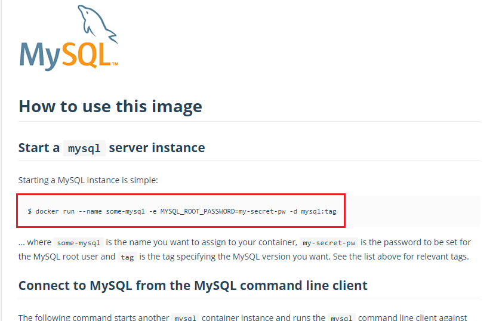
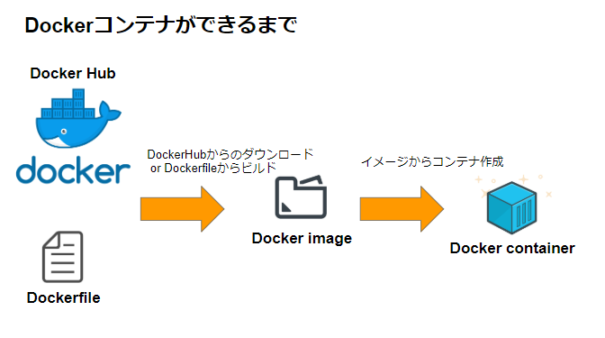

# Docker勉強会

    windows版dockerの話はしません
    Docker for macで動かしています

## Dockerとは

> Dockerは、コンテナと呼ばれるOSレベルの仮想化環境を提供するオープンソースソフトウェアである。  
> VMware製品などの完全仮想化を行うハイパーバイザ型製品と比べて、ディスク使用量は少なく、
> 仮想環境 (インスタンス) 作成や起動は速く、性能劣化がほとんどないという利点を持つ。  
> (Wikipediaより引用)

   
参考：https://cn.teldevice.co.jp/column/10509/

- ひとことで言えば、アプリ部分に最適化された仮想化技術。

- 従来の仮想化技術に比べて省リソースで爆速に環境を作れる。

参考：[国内のDocker事情](https://www.idc.com/getdoc.jsp?containerId=prJPJ45328619
- 基本的には右肩上がり
- 個人、開発環境周りだともっと多いかもしれない。

## Docker周りのツール類

|コマンド・ツール|役割|
|--|--|
|dockerコマンド|一つのコンテナを操作する、基礎となるコマンド|
|docker-compose|一つのアプリを構築する（単純なdockerコマンドだけで実現しにくいもの。複数コンテナ使用、データ永続化など）|
|dokcer-machine|Dockerを動かす仮想マシンの設定|
|kubernetes(or docker swarm)|コンテナのクラスタリングや負荷分散等のスケーリング時に使う（大規模用）|
|Kitematic|DockerをGUIで使えるツール|

今回は主にdokcerコマンドとdocker-composeの話
  

## HelloWorld

Hello Worldする前に

```
docker ps -a
```

### docker ps
現在起動しているコンテナの一覧を表示する。
(-aオプションで起動していないものも含めて表示する)

いざHello World

### docker run
dockerコンテナの実行
```
docker run hello-world
```

#### 基本形
```
docker run [イメージ名]
```
runとイメージ名の間にオプションを挟んでいく

## MySQLのコンテナを実行する(DockerHubのイメージを利用する①)

MySQL dockerとかで検索すると、
DockerHubにMySQLの公式イメージが見つかるので使い方を確認する

https://hub.docker.com/_/mysql



設定部分をちょっと変えて実行する
```
docker run --name sample_mysql -e MYSQL_ROOT_PASSWORD=root -d mysql:latest
```

|オプション|意味|
|--|--|
|--name|名前を付ける|
|-e|環境変数を設定する|
|-d|デタッチドモードで起動する（これ無しだと起動してコンテナが実行された後停止してしまう）|

#### 何が起きたのか



dockerイメージがダウンロードされている
```
docker images
```

### 今立てたコンテナに入ってMySQLを使う
docker execコマンドを使って今立てたコンテナにsshで入ることができます。

```
docker exec -it sample_mysql /bin/bash 
```

> docker execはコンテナの中でコマンドを実行するためのコマンドですが、  
> -itオプションとbashコマンドと併用することでコンテナの中に入るのによく使います。


入れたら
```
mysql -uroot -p
```

これでMySQLが使えるはずです。


不要になったら
```
docker stop sample_mysql      // コンテナの停止
// docker start sample_mysql  // コンテナの起動
docker rm sample_mysql        // コンテナの削除
```

## Pythonのコンテナを実行する(DockerHubのイメージを利用する②)
https://hub.docker.com/_/python/

Dockerfile書いて使うみたいに書いてるけど一旦docker runしてみる

```
docker run -it --rm --name python_sample python
```

|オプション|意味|
|--|--|
|-it|コンソールに実行結果を出力する（-iが標準入力の割り当て、-tが疑似ttyを割り当てる。ほとんどセットで使う）|
|--rm|コンテナ実行後、そのコンテナを削除する|


Pythonが入ってなくともPythonが実行できる・・・！

## Dockerfileからイメージを作成する

[ここのファイル](https://github.com/Kanatani28/docker-intro/tree/master/dockerfile_sample)を使ってPython×Flaskの実行環境を作ってみましょう。

```
.
├── Dockerfile         // これから作るDocker imageの情報が書かれている
├── requirements.txt   // Pythonで使うライブラリの情報が書かれている(Javaで言うbuild.gradle的な)
└── sample.py          // Pythonで作成したアプリ（HelloWorldを返すWebアプリ）
```

### Dockerfile書き方

|命令名|意味|
|--|--|
|FROM|ベースにするイメージ名（大体一番上に書く）|
|WORKDIR|コンテナ内での作業ディレクトリ|
|COPY|ホストからコンテナへファイルをコピーする|
|RUN|コマンドを実行する|
|EXPOSE|コンテナが開放するポートを指定する|
|CMD|コンテナ起動時に実行するコマンドを設定する|

### docker build
Dockerfileのある場所で以下のコマンドを実行するとDockerイメージが作成されます。
```
docker build -t my-python .
```

#### 基本形
```
docker build [Dockerファイルのある場所]
```

|オプション|意味|
|--|--|
|-t|"名前:タグ"形式でイメージに名前をつける|

```
docker run --name maro-python -p 5000:5000 -d my-python
```

## docker-compose


VS CodeのRemote Containerってプラグインが結構素敵

dockerコマンドでpandocを使う（使い捨ての良さを活かして）
